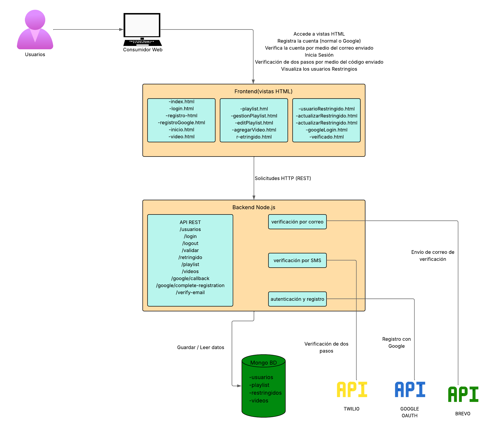

# KidsTube Frontend

## Introducción
-----------

Este proyecto es el frontend del sistema KidsTube, diseñado para proporcionar una interfaz de usuario amigable y atractiva para la plataforma KidsTube. El proyecto está desarrollado utilizando tecnologías web modernas como HTML, CSS y JavaScript.

## Descripción
-----------

KidsTube es una plataforma web diseñada para permitir a los padres seleccionar y controlar el contenido que sus hijos pueden ver. La plataforma permite agregar videos de YouTube o subir videos propios, asegurando un entorno seguro y personalizable para los niños.

## Desarrolladores
--------------

Este proyecto ha sido desarrollado por:

- **Andrea Benavides** - https://github.com/abenavides01
- **Jacqueline Molina** - https://github.com/Jacqueline345

## Tecnologías Utilizadas
-------------------------

- **Lenguaje de Programación**: JavaScript
- **Estilos**: CSS
- **Estructura**: HTML

## Arquitectura del Sisitema
----------------------

Este diagrama representa la arquitectura del sistema KidsTube. Muestra la interacción entre el frontend (vistas HTML), el backend (API REST), la base de datos MongoDB y los servicios externos como Google, Brevo y Twilio.

## Estado del Proyecto
----------------------
Este proyecto está en desarrollo activo.